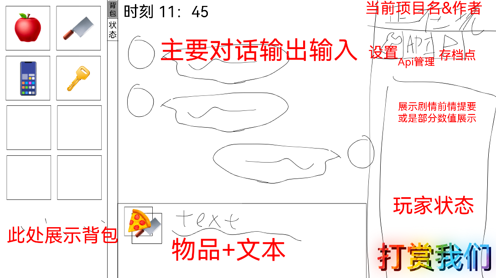

# AIGroupChatroom

## 整体思路

### 后端

#### 设计组件

1. 世界环境配置
   1. 世界地图
   2. 环境地图
   3. 功能区
   4. 物品
   5. 时间轴
2. 人物配置
   1. 基础数值和设定
   2. 拓展
3. AI
   1. API
   2. 角色
      1. 扮演人物
      2. 判决
      3. 触发互动
4. 自定义场景
   1. 允许自定义几乎所有内容，除了底层代码
   2. 允许拥有一定范围内的变量
5. 官方场景
   1. 与现实时间一致、统一的场景
   2. 每个角色不同的基础设置，每个人都是不同的玩法
6. AI增强
   1. t2i
   2. i2v | t2v
   3. tts | stt
   4. 动态生成角色差分、动作、衣着

基础游玩过程：
选择剧本 -> 控制人物 -> 事件流程 -> 循环（控制人物） -> 结束

事件流程：
(处理比较 -> 判决AI ->) 更新世界数据 -> 作用域广播（人物、物品、场景） (-> 触发互动) -> 如果触发新事件
有-> 事件流程
无-> 继续

其中，判决AI判断以下内容：

1. 选择数值比较
2. 直接做出哪一方行动成功，结果如何

### 前端

## 组件实现

### 世界环境配置

#### 世界地图

#### 环境地图

基础区域知识提供者。

#### 功能区

功能区是环境地图的细节，处理与角色

## 界面设计

### 尝鲜版

来自`特斯拉`的尝鲜版页面设置：

## License

Creative Commons Attribution-NonCommercial-ShareAlike 4.0 International (CC BY-NC-SA 4.0)

https://creativecommons.org/licenses/by-nc-sa/4.0/

© 2025 BrownHello
